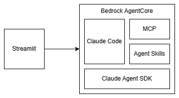
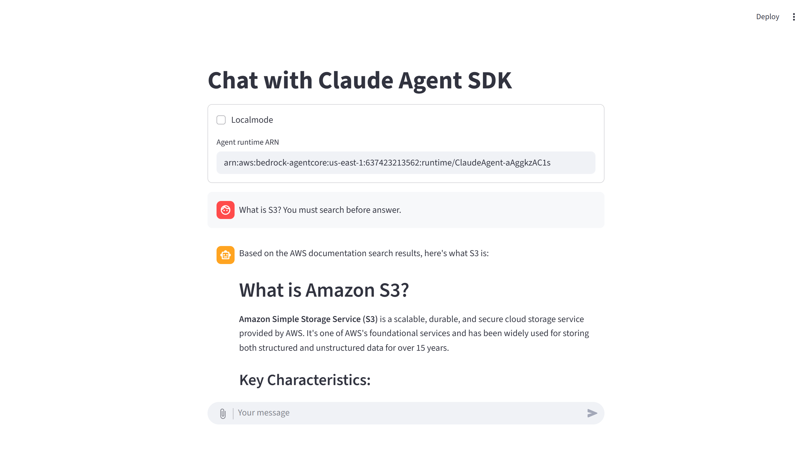
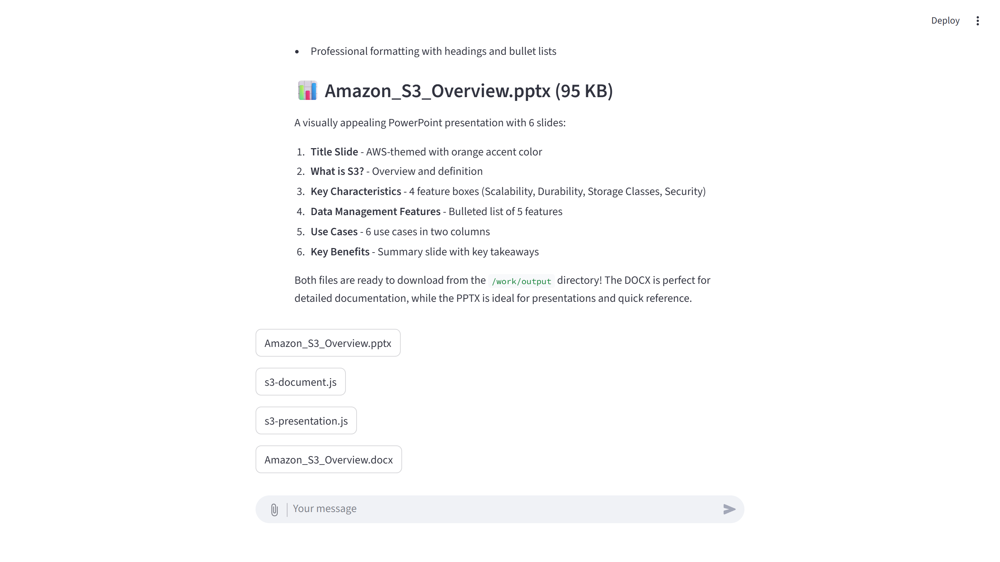

# Claude Code on AgentCore

Build and deploy AI agents using Claude Code and Claude Agent SDK on Amazon Bedrock AgentCore.



## Key Features

- Advanced agentic capabilities powered by Claude Code
- Claude models via Amazon Bedrock
- MCP support (stdio and Streamable HTTP)
- Agent Skills integration
- File input/output handling
- Multi-turn conversations with session isolation
- Security guardrails to prevent malicious command execution
- Infrastructure deployment with AWS CDK

## Backend Deployment

```shell
cd backend
npm i
npm run deploy
```

## Running Backend Locally

This starts the AgentCore Runtime Docker container at `http://localhost:8080`.

```shell
cd backend/assets/claude-agent
docker compose up
```

> **Note:** For macOS environments, update the dockerfile specification in `docker-compose.yaml`:
> 
> ```diff
> services:
>   claude-agents:
>     build:
>       context: .
> -     dockerfile: Dockerfile.amd64
> -     # dockerfile: Dockerfile
> +     # dockerfile: Dockerfile.amd64
> +     dockerfile: Dockerfile
> ```

> **Note:** If deployment fails on WSL2, run `npm run setup-qemu` first.
> 
> Reference: https://docs.docker.com/build/building/multi-platform/#qemu

## Running Frontend

```shell
cd frontend
uv run streamlit run main.py
```

When connecting to a locally running backend, enable "Localmode" in the UI.





## Configuration

### MCP

Add your MCP server configuration to:

- backend/assets/claude-agent/app/.mcp.json

    ```json
    {
    "mcpServers": {
        "aws-mcp": {
        "command": "uvx",
        "args": [
            "mcp-proxy-for-aws@latest",
            "https://aws-mcp.us-east-1.api.aws/mcp",
            "--metadata",
            "AWS_REGION=us-west-2"
        ],
        "env": {
            "OTEL_PROPAGATORS": "none"
        }
        }
    }
    }
    ```

When adding MCP servers, also update the `allowed_tools` list in `backend/assets/claude-agent/app/main.py`.

### Agent Skills

Add skills to the `backend/assets/claude-agent/app/.claude/skills` directory.

If your skills require additional libraries, update the Dockerfile accordingly.

### Claude Models

Model configuration is set via environment variables in the Dockerfile:

```dockerfile
ENV CLAUDE_CODE_USE_BEDROCK=1\
    ANTHROPIC_MODEL=haiku \
    ANTHROPIC_DEFAULT_SONNET_MODEL=global.anthropic.claude-sonnet-4-5-20250929-v1:0\
    ANTHROPIC_DEFAULT_HAIKU_MODEL=global.anthropic.claude-haiku-4-5-20251001-v1:0 \
    CLAUDE_CODE_SUBAGENT_MODEL=haiku \
    MAX_THINKING_TOKENS=1024 \
    MCP_TIMEOUT=600000 \
    MCP_TOOL_TIMEOUT=600000
```

### Security Guardrails

The system prompt includes security restrictions to prevent malicious command execution:

- Blocks system information gathering (uname, whoami, etc.)
- Prevents user enumeration and reconnaissance
- Restricts software installation
- Blocks privilege escalation attempts
- Prevents SSRF attacks (blocks localhost, metadata endpoints, private IPs)
- Allows external data fetching via curl/wget to public endpoints only
- Restricts file operations to `/work/input` and `/work/output` directories

Security settings can be customized in `backend/assets/claude-agent/app/main.py` by modifying the `system_prompt` variable.
